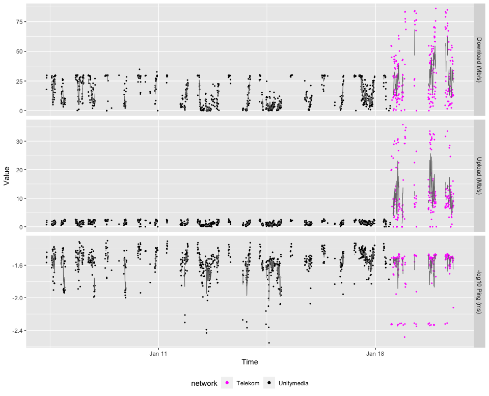

# Install the speedtest command line interface

The tool is called [`speedtest-cli`](https://github.com/sivel/speedtest-cli). The below shell command is for Mac OS X and homebrew. Replace by your favourite package manager.


```sh
brew install speedtest-cli
```

# Set up crontab to run it in regular intervals

This works on Unix-derived systems like Linux and Mac OS X. Edit the crontab using


```sh
env EDITOR=nano crontab -e
```

and add a line similar to:


```sh
 */5 * * * * /Users/whuber/svnco/speedtest/run-speedtest-cli.sh
```

This will run the shell script `run-speedtest-cli.sh`, which is provided in a separate file, every 5 minutes. Of course you'll have to adapt the file path to your local setup. Check the documentation of `crontab` if you want to run it at different times or intervals. Make sure the file is executable, with e.g.


```sh
chmod 755 /Users/whuber/svnco/speedtest/run-speedtest-cli.sh
```


# Visualize the data


```r
library("readr")
library("tidyr")
library("dplyr")
library("magrittr")
library("ggplot2")
```

Get the CSV header and read the CSV file

```r
hosts = c("spinoza", "boltzmann")
logfile = "/Users/whuber/Dropbox/speedtest/speedtest-%s.csv"
  
header = system2("speedtest-cli", args = c("--csv-header"), stdout = TRUE)  %>%
  strsplit(split = ",") %>% `[[`(1)

st = lapply(hosts, function(h) {
  read_csv(sprintf(logfile, h), col_names = FALSE) %>%
  `colnames<-`(header)  %>% 
  mutate(hostname = h)
}) %>% bind_rows 

stopifnot(all(is.finite(st$Timestamp)))
is_fin = is.finite(st$Download)
stopifnot(identical(is_fin, is.finite(st$Upload)),
          identical(is_fin, is.finite(st$Ping)))
with(st,
  table(ifelse(is.na(Download), "NA", ifelse(Download==0, "0", ">0")), 
        hostname))
```

```
##     hostname
##      boltzmann spinoza
##   >0      1931    3140
##   0         25       5
##   NA        40      76
```

```r
negping = (st$Ping <= 0)
if (any(negping)) {
  print(st[which(negping), ])
  st = filter(st, (!negping) | is.na(st$Ping))  
}
```

```
## # A tibble: 2 x 11
##   `Server ID` Sponsor `Server Name` Timestamp           Distance   Ping Download
##         <dbl> <chr>   <chr>         <dttm>                 <dbl>  <dbl>    <dbl>
## 1       25942 fiberO… Darmstadt     2020-06-16 11:13:33     47.5  -3.81   3.51e6
## 2       10291 TWL-KOM Ludwigshafen  2020-06-08 00:48:27     20.0 -29.4    3.03e7
## # … with 4 more variables: Upload <dbl>, Share <lgl>, `IP Address` <chr>,
## #   hostname <chr>
```

```r
variables = c("Download (MB/s)", "Upload (MB/s)", "log10 Ping (ms)")
st %<>% mutate(
  `Download (MB/s)` = Download / 2^23,
  `Upload (MB/s)` = Upload / 2^23,
  `log10 Ping (ms)` = log10(Ping)) %>% 
   pivot_longer(cols = all_of(variables))
st$name %<>% factor(levels = variables)
```

Stratify by  "IP Address", which indicates whether the measurement was taken in Unitymedia broadband, LTE Telekom or at work at EMBL.

The `stopifnot` call makes sure that all instances of `IP Address` that are not `NA` are one of the three addresses below. 
Subsequently we assume that the cases where `IP Address` is `NA` were at home, i.e. in the Unitymedia network.


```r
servers = c(Unitymedia = "176.199.210.217", EMBL = "194.94.44.220", Telekom = "80.187.97.51")
mt = match(st$`IP Address`, servers)
stopifnot(all( (!is.na(mt)) | is.na(st$`IP Address`) ))
st$network = names(servers)[ifelse(is.na(mt), 1, mt)]
```


```r
makeplot = function(x, thenetwork, from = "2020-01-01", to = "2020-12-31") {
  x = filter(x, Timestamp >= from & Timestamp <= to & network == thenetwork) 
  ggplot(x, aes(x = Timestamp, y = ifelse(is.na(value), 0, value))) + 
    # Sadly, it seems that the below timezone setting is ignored by ggplot2
    scale_x_datetime(timezone = "CEST") + 
    xlab("Time") + ylab("Value") + 
    geom_point(aes(col = hostname, shape = is.na(value), size = is.na(value))) + 
    facet_grid(rows = vars(name), scales = "free_y") +
    scale_shape_manual(values = c("FALSE" = 16, "TRUE" = 4)) +
    scale_size_manual(values = c("FALSE" = 0.5, "TRUE" = 1.5)) +
    theme(legend.position = "bottom") + scale_colour_brewer(palette = "Set1") +
    guides(shape = "none", size = "none")
 }
makeplot(st, thenetwork = "Unitymedia")
```

<!-- -->

```r
dev.copy(pdf, file = "speedtest.pdf", width = 16, height = 8)
```
